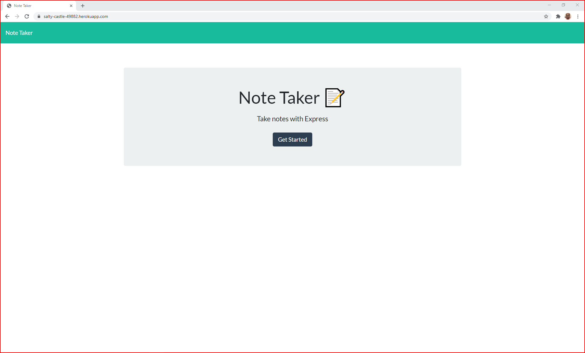

# 11_Note_Taker_MR

  

## Description

Created an application that can be used to write, save, and delete notes. This application will use an express backend and save and retrieve note data from a JSON file.

* The following HTML routes created:

  * GET `/notes` - return the `notes.html` file.

  * GET `*` - return the `index.html` file

* The application  have a `db.json` file on the backend that will be used to store and retrieve notes using the `fs` module.

* The following API routes created:

  * GET `/api/notes` -read the `db.json` file and return all saved notes as JSON.

  * POST `/api/notes` - receive a new note to save on the request body, add it to the `db.json` file, and then return the new note to the client.

  * DELETE `/api/notes/:id` - receive a query parameter containing the id of a note to delete. 

## User Story

AS A user, I want to be able to write and save notes

I WANT to be able to delete notes I've written before

SO THAT I can organize my thoughts and keep track of tasks I need to complete

  ## Table of Contents:
  
  * [Installation](#installation)
  * [Usage](#usage)
  * [License](#license)
  * [Contributors](#contributors)
  * [Tests](#tests)
  * [Questions](#questions)
  * [Mock-Up](#mock-up)
    
  ## Installation
  
  The following necessary dependencies must be installed to run the application properly: Run "npm i" or "npm install"
  
  ## Usage 
  
  This application can be used to write, save, and delete notes. Run "node server.js" to prompt to the browser.
  
  ## License
  
  This project is license under the MIT License license.
  
  ## Contributors
  1 Contributor - Mahbub
  
  ## Tests
  
  To run tests, you need to run the following command: npm run test

  # Questions

  If you have any questions about the repo, open an issue or contact mahbub798 directly mahbub798@gmail.com.

  ## Mock-Up

The following image demonstrates how the application looks like:

